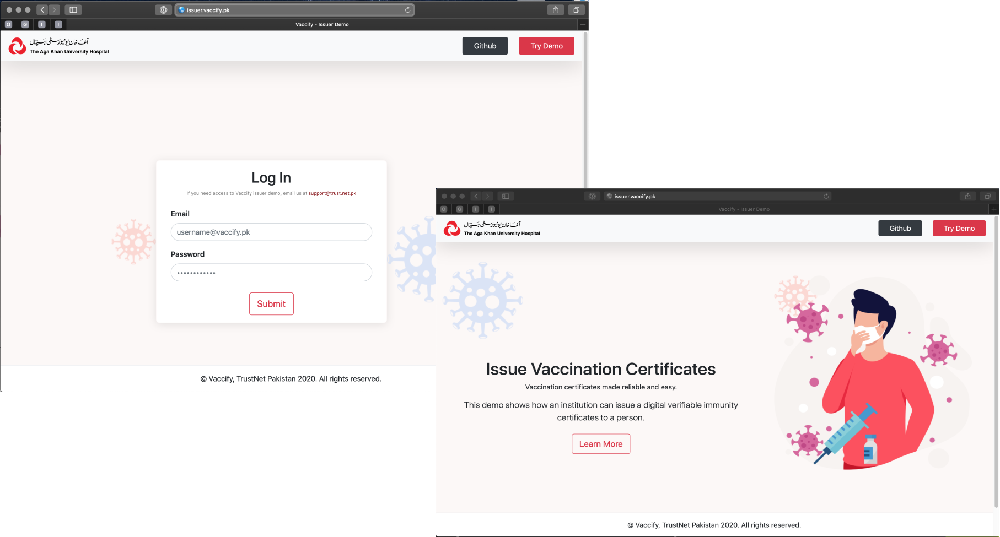

# COV-ID Issuer Application
A front-end application to issue COVID-19 vaccine digital verifiable credential for medical institutes.

# Screenshots



# How to run
```
git clone https://github.com/TrustNetPK/cov-id-issuer.git
cd cov-id-issuer-demo
npm install
npm start
```

# License
<a rel="license" href="http://creativecommons.org/licenses/by-nc-sa/4.0/"></a><br />This work is licensed under a <a rel="license" href="http://creativecommons.org/licenses/by-nc-sa/4.0/">Creative Commons Attribution-NonCommercial-ShareAlike 4.0 International License</a> by TrustNet Pakistan.
